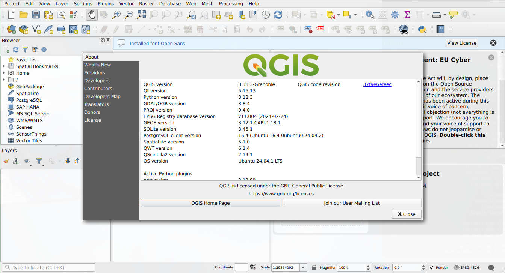

# Install docker

  Visit https://github.com/docker/docker-install (last accessed on September, 22th 2024) and follow the instructions.

  /TLDR:/

  ```shell
  curl -fsSL https://get.docker.com -o get-docker.sh
  sh get-docker.sh
  ```

  /Check:/

  ```shell
  docker --version
  ```

  ```
  Docker version 24.0.7, build 24.0.7-0ubuntu2~22.04.1
  ```

# Run QGIS via docker

  Change directory into the qgis project and from the command line (terminal) execute the following command
  
  ```shell
  # https://hub.docker.com/r/qgis/qgis/tags
  # docker pull qgis/qgis:3.38.3-noble

  # adapted from https://gis.stackexchange.com/a/445973
  docker run \
         --rm -it \
         -u $UID \
         -e DISPLAY=$DISPLAY \
         -v /etc/passwd:/etc/passwd:ro \
         -v $PWD:$HOME \
         -v /tmp/.X11-unix:/tmp/.X11-unix \
         -v $HOME/.Xauthority:$HOME/.Xauthority \
         qgis/qgis:3.38.3-noble \
         qgis
  ```

  
